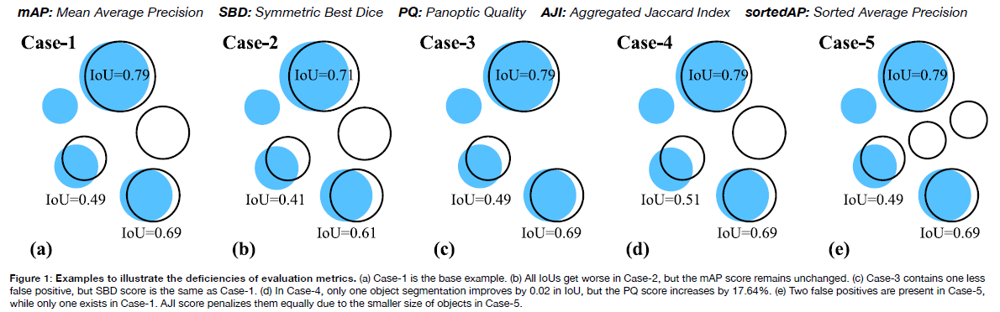

# SortedAP: Rethinking evaluation metrics for instance segmentation

[Institute of Imaging & Computer Vision, RWTH Aachen University](https://www.lfb.rwth-aachen.de/en/)  

This repository contains the implementation of sortedAP, a new evaluation metric for instance segmentation. The metric is described in the papers:

- Long Chen, Martin Strauch and Dorit Merhof. 
[*SortedAP: Rethinking evaluation metrics for instance segmentation*](https://openaccess.thecvf.com/content/ICCV2023W/BIC/html/Chen_SortedAP_Rethinking_Evaluation_Metrics_for_Instance_Segmentation_ICCVW_2023_paper.html)
International Conference on Computer Vision (ICCV) Workshops, Paris, France, Oct. 2023.

Please [cite the paper(s)](#how-to-cite) if you are using this code in your research.

## Overview:
Designing metrics for evaluating instance segmentation revolves around comprehensively considering object detection and segmentation accuracy. However, other important properties, such as sensitivity, continuity, and equality, are overlooked in previous metric designs. In this paper, we reveal that most existing metrics have a limited resolution of segmentation quality. They are only conditionally sensitive to the change of masks or false predictions. For certain metrics, the score can change drastically in a narrow range which could provide a misleading indication of the quality gap between results. Therefore, we propose a new metric called sortedAP, which strictly decreases with both object- and pixel-level imperfections and has an uninterrupted penalization scale over the entire domain. We evaluated the newly designed sortedAP with respect to the following three properties:

**Sensitivity.** An ideal metric should be sensitive to all occurrences of imperfections of all types. Any additional errors are supposed to lead monotonically to a worse score, not ignored or obscured by the occurrence of other errors. A metric that monotonically decreases with any errors will enable a more accurate comparison.

**Continuity.** The penalization scale of a metric should be relatively consistent locally across the score domain. Intuitively, gradually and evenly changing segmentations should correspond to a smoothly changing metric score as well. Abrupt changes are not desired.

**Equality.** Without any assumed importance of different objects, all objects should have an equal influence on the metric score. A common case of inequality is that the score is biased towards larger objects. Although larger objects may be prioritized in some applications, as a general metric, the metric should treat all objects equally. Analysis with respect to object size can be easily performed by evaluating different size groups using a metric of equal property.

<p align="center">

<p>

### sortedAP

We propose sorted Average Precision (sortedAP) as a new metric that is sensitive to all segmentation changes. The concept of sortedAP involves identifying all IoU values at which the AP score drops, instead of querying AP scores at fixed IoUs as the mAP. The AP score can only change at the IoUs of each object where the object transitions from true positive to false positive. Raising the matching threshold
from 0 to 1 will turn all matches into non-matches one by one in the ascending order of IoU. In consequence, one non-match will diminish a true positive and introduce a false negative.

<p align="center">

<p>

## Usage

### Dependency
- python=3.x
- scipy

### Supported metrics

- AJI: [aggregated Jaccard index](https://ieeexplore.ieee.org/document/7872382)
- SBD: [Symmetric Best Dice](https://link.springer.com/article/10.1007/s00138-015-0737-3)
- mAP: [mean Average Precision](https://www.kaggle.com/c/data-science-bowl-2018/overview/evaluation)
- PQ: [Panoptic Quality](https://arxiv.org/abs/1801.00868)
- sortedAP: our proposed metric


### Bais Example


```python

from evluation import Evaluator

e = Evaluator(dimension=2, allow_overlap=True, match_method='hungarian', image_average=False)

### example of evaluating segmented cells ###

cell_gt = read_indexed_png('./demo/cells_gt.png')
cell_pred = read_indexed_png('./demo/cells_pred.png')

e.add_example(cell_pred, cell_gt)

e.AJI() # aggregated Jaccard index
e.SBD() # Symmetric Best Dice
e.PQ(thres=0.5) # Panoptic Quality
e.mAP(thres=None) # mean Average Precision, default thres ranges from 0.5 to 0.95 with a step size of 0.05
e.sortedAP() # sortedAP


### example of segmented leaves ####

e.clear() # clear the added cell example

for f in os.listdir('./demo/CVPPP_leaves'):
    gt = read_indexed_png(os.path.join('./demo/CVPPP_leaves', f, 'gt.png'))
    pred = read_indexed_png(os.path.join('./demo/CVPPP_leaves', f, 'pred.png'))
    e.add_example(pred, gt)

# aps contain pairs of (jac, ap), sorted in jac(IoU) increasing order
scores, aps = e.sortedAP()

# plot the complete AP curve
aps = np.array(aps)
plt.plot(aps[:,0], aps[:,1])
plt.xlabel("Jaccard Index (IoU)")
plt.ylabel('AP (Average Precision)')
plt.show()

```

## How to cite
```bibtex
@InProceedings{Chen_2023_ICCV,
    author    = {Chen, Long and Wu, Yuli and Stegmaier, Johannes and Merhof, Dorit},
    title     = {SortedAP: Rethinking Evaluation Metrics for Instance Segmentation},
    booktitle = {Proceedings of the IEEE/CVF International Conference on Computer Vision (ICCV) Workshops},
    month     = {October},
    year      = {2023},
    pages     = {3923-3929}
}
```